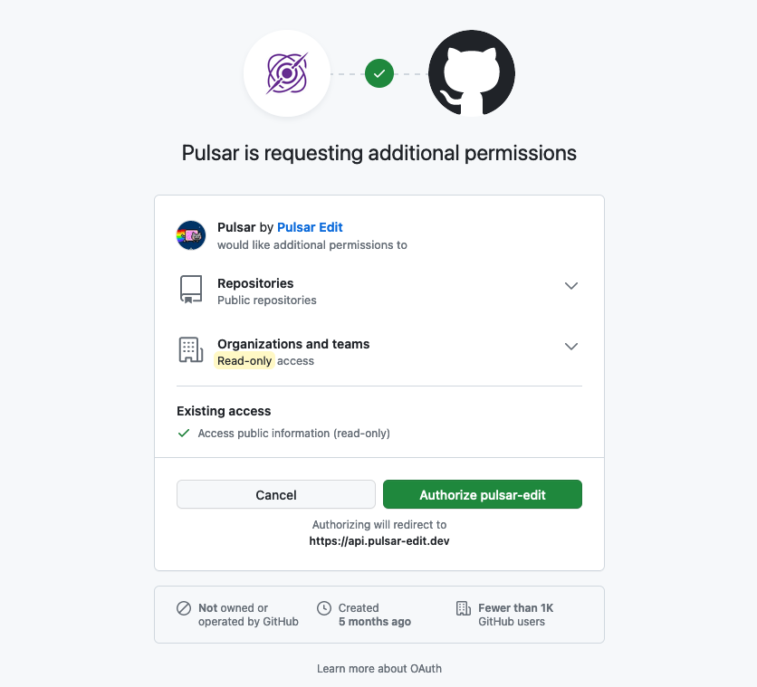

# Creating an Account

This document provides instructions and information on how to create a Pulsar account.

### Target Audience / Requirements / Objectives

This document is aimed at user's that are new to Pulsar wanting to create an account with Pulsar. An account is not required to use Pulsar or the Pulsar Package Registry (downloading and installing community packages), but an account is required to publish community packages, or to star community packages.

This document assumes you are somewhat familiar with GitHub, and are able to use any web browser.

To complete the steps in this document it is required to have the following:

  * A GitHub account
  * Access to the Internet
  * A Web Browser installed to your device

After reading through this document, it is expected that you'll learn the following:

  * How to create a Pulsar account.
  * How to delete your Pulsar account.
  * What information Pulsar stores about you, in order to create your account.

## Getting Started

To begin creating your Pulsar account you'll first need to navigate to the [Pulsar website sign up page](https://web.pulsar-edit.dev/login) (https://web.pulsar-edit.dev/login).

> Example of the Pulsar website sign up page.

As you can see in the image above, there are two methods to create your Pulsar account.

### Signing up with GitHub OAuth

The recommended method of creating a Pulsar account is by signing up using [GitHub OAuth](https://docs.github.com/en/apps/oauth-apps/building-oauth-apps/authorizing-oauth-apps).

GitHub OAuth allows you to link your GitHub account to Pulsar automatically, without having to manage any keys or tokens manually.

To create a Pulsar account with GitHub OAuth, visit the [Signup Page](https://web.pulsar-edit.dev/login) (https://web.pulsar-edit.dev/login), then select "Sign Up with GitHub OAuth". You should then be greeted with the following screen:

> Preview of GitHub OAuth Signup Screen

After thoroughly reading through this prompt, if everything seems satisfactory, you can click "Authorize pulsar-edit". This will allow Pulsar access to your account, which after a few redirects you'll be greeted with the details of your Pulsar account on the [Pulsar Frontend website](./glossary.md).

### Signing up with a GitHub Token

While signing up using a GitHub Token is a little bit more troublesome than using OAuth, it allows much finer control of exactly what Pulsar has access to, and what the token is able to do. Using a GitHub Token to signup with Pulsar means that you create a [**Personal Access Token (PAT)**](https://docs.github.com/en/authentication/keeping-your-account-and-data-secure/creating-a-personal-access-token) via GitHub, and use that token to signup with Pulsar.

When creating your PAT token, there are a few permissions that are recommended to be used for your Pulsar account:

  * `public_repo`
  * `read:org`

> These are the same scopes used when creating a Pulsar account via GitHub OAuth.

Then to create your Pulsar account, follow the below steps:

1. Create your PAT as described above.
2. Navigate to the Pulsar [signup page](https://web.pulsar-edit.dev/login).
3. Enter your PAT token where indicated on the page.
4. Press enter and wait until you see your account details on the [Pulsar Frontend website](./glossary.md).

## Updating your Pulsar account

You may notice that after changing your profile picture, or username on GitHub that Pulsar doesn't show these changes. Because the Pulsar Package Registry doesn't automatically update the details of your account, you'll need to do it manually, if you'd like to do so.

To update the details of your Pulsar account, again navigate to the [Pulsar Frontend website](https://web.pulsar-edit.dev/) and select "Log Out" in the top header bar. After you have logged out, click to sign up again, and follow the same exact steps you did the first time. Once you've followed the same steps as before, you'll see the details of your Pulsar account, now match what is shown on your GitHub account.

## Deleting your Pulsar account

Unfortunately, at this time there is no automatic way to delete a Pulsar account. But if you'd like to do so, feel free to contact the Pulsar Maintainers and we will be more than happy to help you do so.

## GDPR Inquires

Unfortunately, at this time there is no automatic way to collect all data that is associated with your Pulsar account. But if you'd like a copy of all of your data stored with Pulsar, feel free to contact the Pulsar Maintainers, and we will be more than happy to help you do so.

## Disclosure about Pulsar accounts

Pulsar, and it's maintainers, greatly respect your privacy, and more-so doesn't want the chance to invade your privacy. That's why when you create a Pulsar account your credentials and sensitive information is never stored within the Pulsar Package Registry at all.

When your create a Pulsar account, the following is the fully inclusive list of information stored about you:

  * Your GitHub account username
  * Your GitHub Gravatar image URL
  * Your GitHub `node_id`

> Think of your `node_id` as a random number assigned to your GitHub account during it's creation. This ID is publicly accessible and poses no security risk to be shared.

Beyond what is listed above, Pulsar stores no additional data about you or your account. All authentication occurs via GitHub during every single request (that requires authentication), and no credentials are stored or logged anywhere within the Pulsar Organization.
